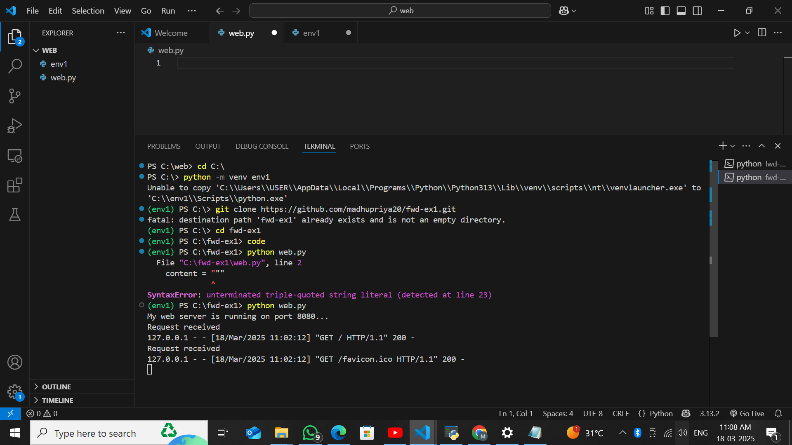

# EX01 Developing a Simple Webserver
## Date:18.03.2025

## AIM:
To develop a simple web server using Python to serve an HTML page with colored headings

## DESIGN STEPS:
### Step 1: 
HTML content creation.

### Step 2:
Design of webserver workflow.

### Step 3:
Implementation using Python code.

### Step 4:
Import the necessary modules.

### Step 5:
Define a custom request handler.

### Step 6:
Start an HTTP server on a specific port.

### Step 7:
Run the Python script to serve web pages.

### Step 8:
Serve the HTML pages.

### Step 9:
Start the server script and check for errors.

### Step 10:
Open a browser and navigate to http://127.0.0.1:8000 (or the assigned port).

## PROGRAM:
'''
from http.server import HTTPServer, BaseHTTPRequestHandler

content = ~~~
<!DOCTYPE html>
<html>
<body>

<h1 style="background-color:Tomato;">Tomato</h1>
<h1 style="background-color:Orange;">Orange</h1>
<h1 style="background-color:DodgerBlue;">DodgerBlue</h1>
<h1 style="background-color:MediumSeaGreen;">MediumSeaGreen</h1>
<h1 style="background-color:Gray;">Gray</h1>
<h1 style="background-color:SlateBlue;">SlateBlue</h1>
<h1 style="background-color:Violet;">Violet</h1>
<h1 style="background-color:LightGray;">LightGray</h1>

</body>
</html>
~~~

class MyHandler(BaseHTTPRequestHandler):
    def do_GET(self):
        print("Request received")
        self.send_response(200)
        self.send_header('Content-type', 'text/html; charset=utf-8')
        self.end_headers()
        self.wfile.write(content.encode())

server_address = ('', 8080)  
httpd = HTTPServer(server_address, MyHandler)
print("My web server is running on port 8080...")
httpd.serve_forever()
'''

# OUTPUT:
#.png>)

## RESULT:
The program for implementing simple webserver is executed successfully.

